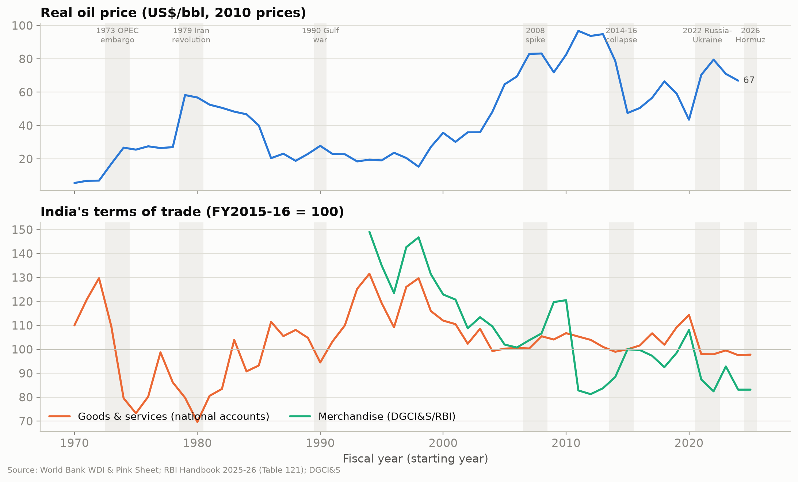

# Oil Price Shocks and India's Terms of Trade: An Empirical Assessment

International Economics, group project. A 15-minute presentation followed by a 15-minute viva.

India imports about 90% of the crude it refines, so every oil spike changes what India's exports can buy abroad.
We measure how much, using the net barter terms of trade from the course (export unit value index over import
unit value index), and ask three questions:

- **H1.** Do oil price rises worsen India's terms of trade, and by how much?
- **H2.** Do rises and falls have the same effect?
- **H3.** Does it matter whether oil became expensive because of a supply cut or a world demand boom?

The theory comes from the course lectures, applied to India rather than explained on its own: offer curves (L22),
the terms-of-trade definition (L21), RCA (L08), Grubel–Lloyd and vertical trade (L17, L19, L20), and monopoly
power (L16). The data come only from official agencies (RBI, DGCI&S, PPAC, World Bank, UNCTAD, UN Comtrade, EIA,
BIS) and the published shock series of Baumeister and Hamilton (2019) and Känzig (2021).



## What we found

| | Result | Key numbers |
|---|---|---|
| **H1** | Supported. Oil price rises worsen India's terms of trade, quickly but temporarily. | Short-run elasticity −0.24 (a 10% oil rise costs 2.4%); 31% of the gap closes each year; monthly peak effect −0.39 after two months |
| **H2** | Not supported. Rises and falls have about the same effect. | Short run −0.27 vs −0.22, symmetry never rejected (p = 0.54–0.91) |
| **H3** | Not supported. Demand-driven rises hurt at least as much as supply-driven ones. | Equality never rejected (p = 0.54–0.71); OPEC news shocks cut the terms of trade 4–5% |
| **Exposure** | India is about half as exposed as in the 1990s, because it became a large refined-fuel exporter. | Rolling elasticity −0.30 → −0.11; theory benchmark (s_x − s_m) −0.25 → −0.10; RCA in refined petroleum 0.06 → 4.37 |

The full write-up of each result is in [`docs/05_results.md`](docs/05_results.md).

## Where to find things

| If you want to… | Go to |
|---|---|
| See the slides | [`presentation/slides.pdf`](presentation/slides.pdf), or [`slides_with_notes.pdf`](presentation/slides_with_notes.pdf) with the speaker script |
| Prepare for the viva | [`viva-notes/`](viva-notes/): one-page summary, theory, data, methods, results, 140 questions with answers, formula sheet ([PDF](viva-notes/Viva_Notes.pdf)) |
| Know what to do before the presentation | [`docs/team_plan.md`](docs/team_plan.md) |
| See how the theory is applied | [`docs/01_theory_framework.md`](docs/01_theory_framework.md) and [`docs/lecture_notes.md`](docs/lecture_notes.md) |
| Read the literature review | [`docs/02_literature_review.md`](docs/02_literature_review.md) and [`docs/references.md`](docs/references.md) |
| Check a data source | [`data/SOURCES.md`](data/SOURCES.md) (every file, URL and checksum) and [`docs/03_data.md`](docs/03_data.md) |
| See every estimate with its output | [`notebooks/`](notebooks/), saved with outputs, so they display on GitHub |
| Open the data in Excel | [`data/processed/final_dataset.xlsx`](data/processed/final_dataset.xlsx) |

```
course-material/lectures/   the 16 lecture PDFs we use, with an index
data/
  raw/                      downloads exactly as published, never edited
  processed/                monthly, annual (fiscal-year) and calendar-year datasets, plus an Excel copy
  SOURCES.md                every raw file: publisher, URL, checksum
  validation_report.md      automatic checks (0 failures)
  validation_log.md         values to check by hand against the original publications
docs/                       theory framework, literature review, data, methods, results, team plan
notebooks/                  01 data and stylised facts ... 06 supply vs demand shocks
src/                        dataset build, validation, econometrics helpers, slide figures
output/figures, tables/     every chart and table the notebooks produce
presentation/               Beamer slides (LaTeX), PDFs, Overleaf zip
viva-notes/                 everything for the question round
```

## The notebooks

| Notebook | What it does |
|---|---|
| [01 · Data and stylised facts](notebooks/01_data_and_stylized_facts.ipynb) | Oil and the terms of trade since 1970; the 2022 and 2026 episodes month by month |
| [02 · Theory applied](notebooks/02_theory_applied.ipynb) | Offer curves for India, oil shares and the benchmark, RCA, Grubel–Lloyd, unit values, the import bill |
| [03 · H1: ARDL](notebooks/03_H1_ardl_long_run.ipynb) | Unit-root tests, ARDL bounds test, diagnostics, robustness |
| [04 · H2: NARDL](notebooks/04_H2_nardl_asymmetry.ipynb) | Rises vs falls, symmetry tests, dynamic multipliers |
| [05 · Size and timing](notebooks/05_benchmark_rolling_monthly.ipynb) | Benchmark test, rolling elasticity, monthly local projections |
| [06 · H3: supply vs demand](notebooks/06_H3_supply_vs_demand.ipynb) | Splitting oil price changes with Baumeister–Hamilton shocks; Känzig cross-check |

## Reproducing the results

Everything runs from the raw files in `data/raw/`, so nothing needs to be downloaded again.

```bash
pip install -r requirements.txt
make            # dataset -> checks -> notebooks -> slides -> viva notes PDF
```

Or step by step: `python src/build_dataset.py`, `python src/validate_dataset.py`, then run the notebooks in
order, then `python src/slide_figures.py` and compile `presentation/slides.tex`. The slides need a TeX Live
install with latexmk; [`presentation/README.md`](presentation/README.md) explains how to edit them on Overleaf instead.

Two large archives (the EIA bulk file and the UNCTAD bulk file) are not committed because of their size. The small
extracts we use from them are, and `src/extract_large_raw.py` recreates the extracts if you download the archives
again.

## Who presents what

| | Slides | Leads on in the viva |
|---|---|---|
| P1 | Hook, question and hypotheses, offer curves for India | Theory |
| P2 | Theory benchmark, literature and gap, data | Data and literature |
| P3 | Method, H1, monthly timing | Econometrics |
| P4 | H2 and exposure, H3, policy | Results and policy |

---

The lecture PDFs in `course-material/` are course material, so this repository should stay private.
